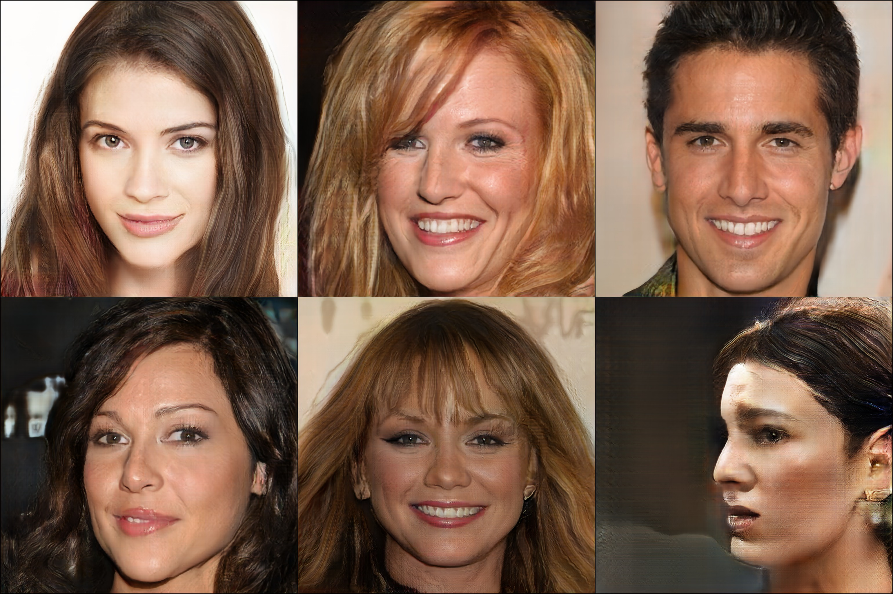
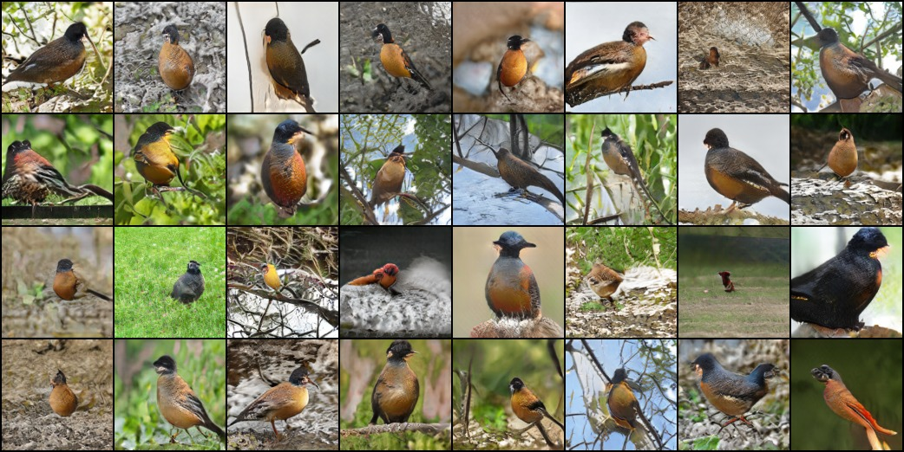
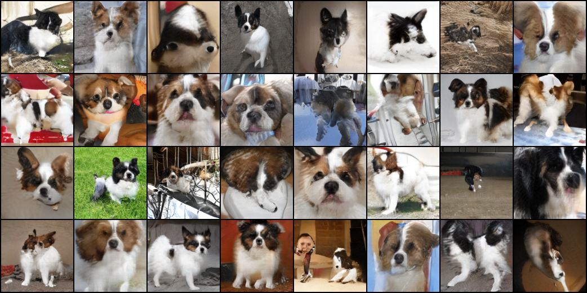
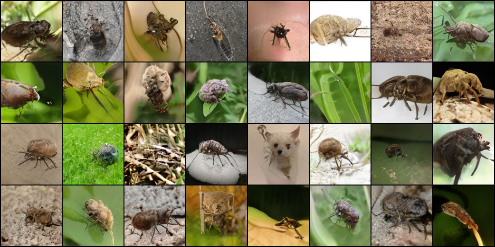
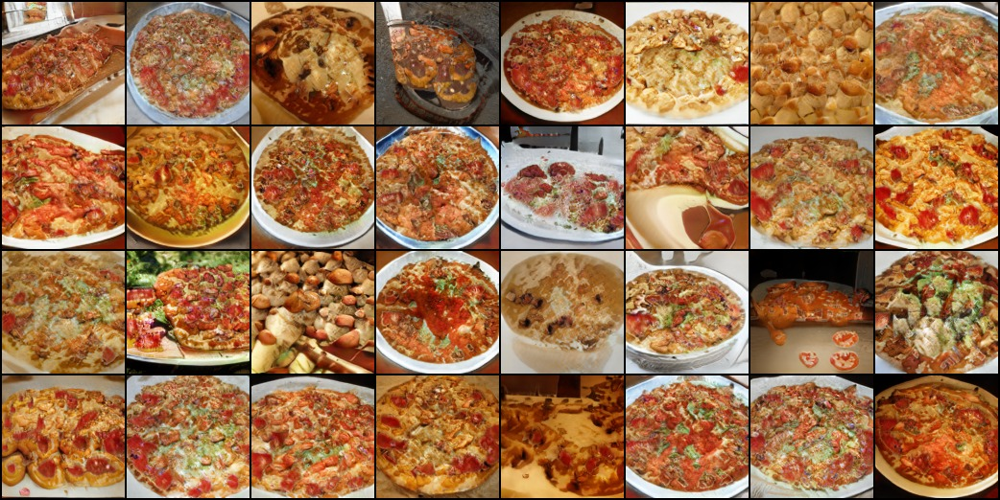
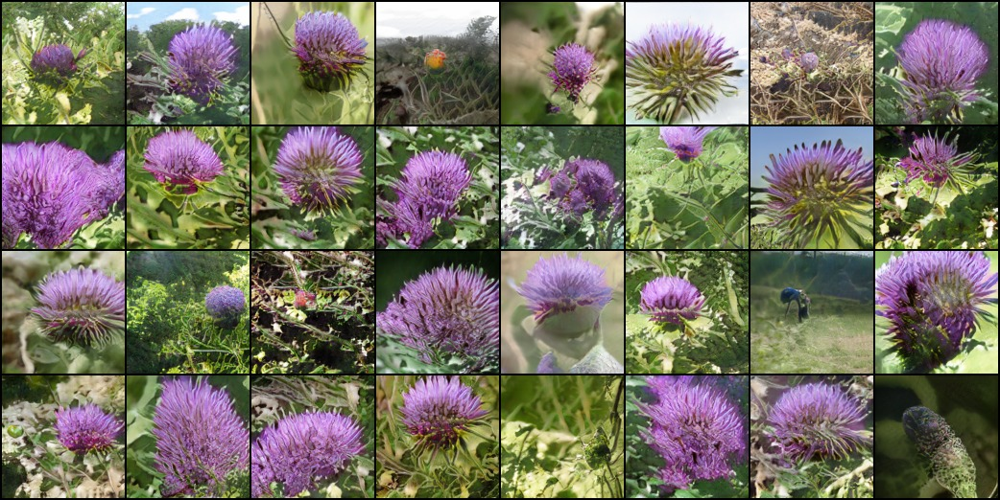

# GAN stability
This repository contains the experiments in the supplementary material for the paper [Which Training Methods for GANs do actually Converge?](https://avg.is.tuebingen.mpg.de/publications/meschedericml2018).

To cite this work, please use
```
@INPROCEEDINGS{Mescheder2018ICML,
  author = {Lars Mescheder and Sebastian Nowozin and Andreas Geiger},
  title = {Which Training Methods for GANs do actually Converge?},
  booktitle = {International Conference on Machine Learning (ICML)},
  year = {2018}
}
```
You can find further details on [our project page](https://avg.is.tuebingen.mpg.de/research_projects/convergence-and-stability-of-gan-training).

# Usage
First download your data and put it into the `./data` folder.

To train a new model, first create a config script similar to the ones provided in the `./configs` folder.  You can then train you model using
```
python train.py PATH_TO_CONFIG
```

To compute the inception score for your model and generate samples, use
```
python test.py PATH_TO_CONFIG
```

Finally, you can create nice latent space interpolations using
```
python interpolate.py PATH_TO_CONFIG
```
or
```
python interpolate_class.py PATH_TO_CONFIG
```

# Pretrained models
We also provide several pretrained models.

You can use the models for sampling by entering
```
python test.py PATH_TO_CONFIG
```
where `PATH_TO_CONFIG` is one of the config files
```
configs/pretrained/celebA_pretrained.yaml
configs/pretrained/celebAHQ_pretrained.yaml
configs/pretrained/imagenet_pretrained.yaml
configs/pretrained/lsun_bedroom_pretrained.yaml
configs/pretrained/lsun_bridge_pretrained.yaml
configs/pretrained/lsun_church_pretrained.yaml
configs/pretrained/lsun_tower_pretrained.yaml
```
Our script will automatically download the model checkpoints and run the generation.
You can find the outputs in the `output/pretrained` folders.
Similarly, you can use the scripts `interpolate.py` and `interpolate_class.py` for generating interpolations for the pretrained models.

Please note that the config files  `*_pretrained.yaml` are only for generation, not for training new models: when these configs are used for training, the model will be trained from scratch, but during inference our code will still use the pretrained model.

# Notes
* Batch normalization is currently *not* supported when using an exponential running average, as the running average is only computed over the parameters of the models and not the other buffers of the model.

# Results
## celebA-HQ


## Imagenet





